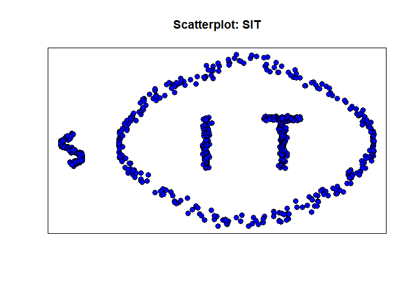
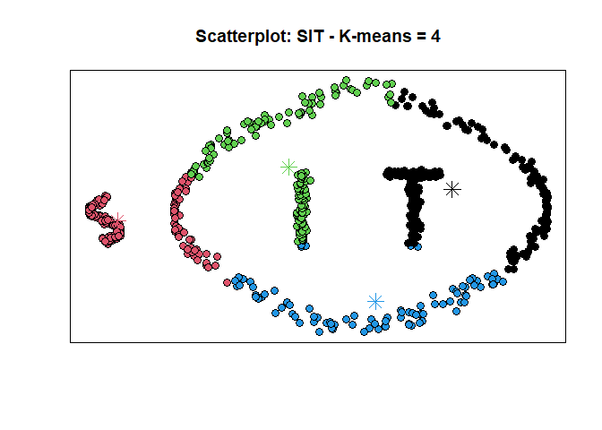
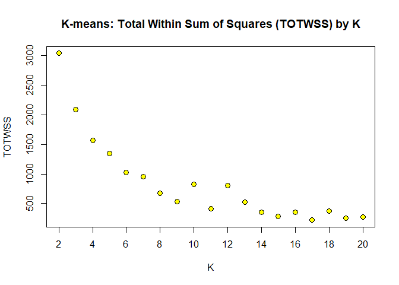
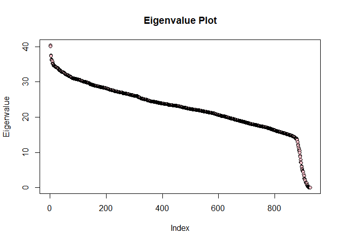
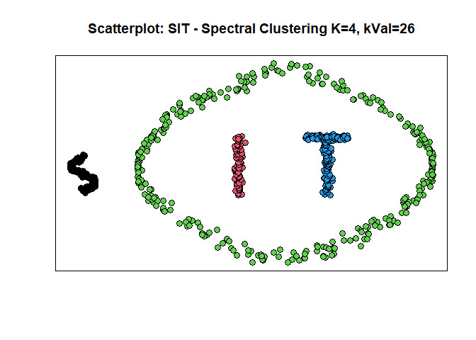
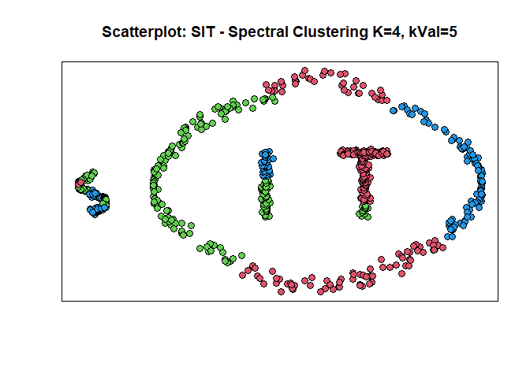

Spectral Clustering for Classification
================
Daniel Gladman
2024-01-05

This article will illustrate the power of spectral clustering in
unveiling complex structures within data, especially when conventional
methods struggle to classify based on these structures.

### Exploratory Analysis

First, we will read in the data needed to perform the analysis and
inspect it by looking at the first 10 rows.

    ##               V1           V2
    ##  [1,] -0.3992147  0.149061815
    ##  [2,] -0.4841207 -0.213135242
    ##  [3,] -0.5812865  0.016028904
    ##  [4,] -0.3111480  0.350052400
    ##  [5,] -0.5798358  0.001451466
    ##  [6,] -0.2898359 -0.225522065
    ##  [7,] -0.5646232 -0.063413225
    ##  [8,] -0.4756992  0.191273102
    ##  [9,] -0.3198651 -0.203706947
    ## [10,] -0.5989489  0.048493144

As we are dealing with what appears to be data consisting of two
features for each instance, we can visualise the entire data with a
scatterplot for V1 vs V2.

<!-- -->

Based on the plot, we can clearly see that the data we were looking at
were actually co-ordinates to plot points on a graph. These points
combined spell the word “SIT”. In addition, there are a series of points
that form an oval-type shape that surrounds the “IT”, creating a
boundary and separating “IT” from the “S”.

From this, we can understand that there are four distinct elements
within the plot:

1.  The “S”,
2.  The “I”,
3.  The “T”, and
4.  The oval-type shape.

Can we use an algorithm that can correctly identify each element in this
plot?

### K-means

K-means is an unsupervised machine learning algorithm widely used for
cluster analysis and data segmentation. It aims to partition a dataset
into K distinct, non-overlapping clusters, where each data point belongs
to the cluster with the nearest mean value.

Because we know there are four distinct elements that we want to
identify, we can set the value of K to 4 and run the algorithm. We will
run over 25 different iterations to find the best clustering solution.

``` r
cl <- kmeans(zz, 4, nstart = 25)
```

<!-- -->

Here we can see that the algorithm did its best to correctly classify
the elements in the plot. It seemed to be very good at finding clusters
that identify the letters. However, the oval presents problems for this
algorithm. Instead of being classified as a complete oval, segments of
the oval are attached to each letter, with a remainder being assigned
its own cluster.

#### Finding the optimal K

Because K-means is an unsupervised algorithm, it is often deployed as an
exploratory tool to uncover patterns and clusters in the data. Often
this is useful when the number of clusters is not known ahead of time.
However, in our case as we know the number of clusters, this algorithm
may not always be the best choice.

To demonstrate why this might be, we can use an elbow plot for different
values of k, and compute the Total Within Sum Of Squares (TOTWSS). The
TOTWSS quantifies the total sum of squared distances of data points to
their respective cluster centroids and serves as a critical metric for
assessing clustering quality. In other words, a lower TOTWSS represents
a more robust model. Naturally, increasing the number of k should
decrease the TOTWSS value as there are more ‘centers’ that will be
theoretically closer to each data point. However, this is not always the
case. Eventually an elbow forms when k hits a critical mass; meaning
that adding any further ‘centers’ to the data will not decrease the sum
of distances between each data point. Any increase in k beyond this
value would be over-fitting to noise within the data. The value of k
where the elbow forms is considered to be the optimal value of k, and
may be indicative of the true number of clusters in the data.

However, is this really the case in our data?

``` r
#Initialize Matrix with 2 columns: One for the K, the other for the TOTWSS
totwss <- matrix(0, nrow = 19, ncol = 2)
totwss[,1] <- 2:20 # Assign 2:20 to first column

#Vectorize the K-means function such that it is applied to each number of K (Faster than for loop)
totwss[,2] <- unlist(lapply(2:20, function(i) kmeans(zz, centers=i)$tot.withinss))  
```

<!-- -->

In our case, an elbow appears to form at around k=7 or k=9. The
empirical evidence for the true number of clusters in the data is
therefore approximately between 7 and 9. However, we know that this
empirical evidence does not match objective reality. This demonstrates
the importance of not blindly relying on data alone to model reality.
Data must always be analysed within a context that captures domain
knowledge about the data.

### Spectral Analysis

Fortunately, we have other tools that can be used for clustering.
Spectral Analysis is one alternative approach. It leverages techniques
from linear algebra and graph theory to uncover patterns in data. Unlike
K-means, which assumes clusters of similar sizes and shapes, Spectral
Analysis can identify clusters of varying shapes and sizes, making it
more versatile in certain scenarios. It works by constructing a
similarity graph from the data points, where each node represents a data
point, and edges between nodes indicate similarity. By analyzing the
eigenvalues and eigenvectors of the graph’s Laplacian matrix, Spectral
Analysis can partition the data into clusters. This technique is
particularly useful when dealing with non-linear and complex data
structures and has found applications in fields such as image
segmentation, community detection in social networks, and more.

Let’s perform Spectral Analysis on our data.

#### Similarity Matrix

The first step for creating a Laplacian matrix, we must first create a
similarity matrix. This is achieved by calculating the pairwise
Euclidean distances between all data points in the data. The similarity
matrix serves as a representation of how closely related each data point
is to every other data point in the data. The distances can by tuned
using a ‘cParam’ which is used to divide the distances between each
point. By dividing the distances, you effectively control the rate at
which the similarity values decrease as distances increase. In our case,
we will leave it as default, but you may play around with the code and
see how changing this parameter influences the outcome.

``` r
dZZ<-as.matrix(dist(zz)) # compute eucleadean distances
cParam = 1 # parameter of similarity function
S<-exp(-dZZ/cParam) #compute similarity matrix
```

#### Affinity Matrix

Next we must compute an Affinity Matrix from the Similarity Matrix. An
Affinity Matrix is a transformation of the Similarity Matrix that
accentuates the relationships or affinities between data points while
suppressing irrelevant or weak connections. This transformation helps
emphasize the structure of the data and identify patterns within it.

As at time of performing this analysis, I am not aware of any packages
in R that can perform this task. I provide some boiler code that will
compute the Affinity Matrix.

``` r
#S-distance matrix and k-no of neighbours
AffMat <- function(S, k) {
  n <- nrow(S)
  AM <- matrix(0, nrow = n, ncol = n)
  
  for (i in 1:n) {
    top_k_indices <- order(S[i, ], decreasing = TRUE)[1:k]
    AM[i, top_k_indices] <- S[i, top_k_indices]
    AM[top_k_indices, i] <- AM[i, top_k_indices]
  }
  
  AM
}
```

Next we need to select a k-value (kVal) which will represent the number
of nearest neighbors for each data point. Although similar in concept,
this kVal should not be confused with how k was defined in the K-means
algorithm demonstrated earlier, where k represented the number of
cluster centers in the data. Within the context of the Affinity Matrix,
This kVal is another tuning parameter that can have significant impact
on the outcome of the analysis by emphasizing smaller granular or
broader global differences in the data. I will illustrate how this value
can influence the result later but for now I will select a kVal of 26
and will create the Affinity Matrix.

``` r
kVal=26   
A<-AffMat(S,kVal)
```

Next, we must compute the degree of the Affinity matrix. This involves
calculating the sum of weights or similarity values associated with each
data point in the Affinity Matrix. In simpler terms, for each data
point, we sum up its connections to all other data points in the data,
considering the strengths of those connections as indicated by the
Affinity Matrix.

#### Degree Matrix

The Degree matrix D is created by summing the rows of A, where each row
corresponds to a data point and the sum represents the total strength of
connections for that data point. These values for each row and then
arranged along the diagonal of the degree matrix.

``` r
D <- diag(apply(A, 1, sum)) # sum rows
```

#### Laplasian Matrix

Finally, the Laplasian Matrix can be computed by subtracting the
Affinity Matrix from the Degree Matrix. This is the matrix that will be
used to compute the eigenvalues needed for the Spectral Analysis.

``` r
L <- D - A
```

#### Eigenvalues/Eigenvectors

Now that we have the Laplasian Matrix, we will compute the eigenvalues
and eigenvectors. We will be using these values to discover the true
number of clusters in the data and correctly classify the data based on
these clusters.

``` r
eigL <-eigen(L)
```

Discussing what eigenvalues are and how they are computed is beyond the
scope of this article, however what you need to know is that eigenvalues
are special numbers that reveal essential information about the
structure of the data. Within the scope of Spectral Analysis we are
interested in the number of extremely small eigenvalues that are present
in the data as they suggest that a cluster is present.

<!-- -->

Here we can see an ordered array of the eignvalues from largest to
smallest. We can see that towards the end of the array, the numbers
approach zero. Let’s look a little closer at the last ten eigenvalues in
the array.

``` r
tail(eigL$values, 10)
```

    ##  [1]  5.664586e-01  3.639977e-01  3.242935e-01  1.769795e-01  1.377542e-01
    ##  [6]  7.738806e-02  1.759976e-14 -8.709646e-15 -1.544775e-14 -1.935875e-14

Notice how there are some very small values at the end of the array,
values that are considerably smaller than the others that precede them.
If we count them, we notice that there are exactly four of these values.
This is a promising sign as we know that we are looking for exactly four
distinct elements in the data.

#### Completing the Spectral Analysis

Now that we have the correct number of small eigenvalues, we can take
their associated eigenvectors and perform the K-means algorithm again.
Running the analysis in this transformed space can aid the algorithm in
allocating the data points to the correct cluster.

First let’s extract the k most significant eigenvectors from the result
of eigen-decomposition using the provided code. We will use k=4 as this
is the number of elements we are looking for.

``` r
k<-4
Z<- eigL$vectors[,(ncol(eigL$vectors)-k+1):ncol(eigL$vectors)]
```

Then, with these selected eigenvectors, we will proceed to perform
spectral analysis. We are applying the K-means clustering algorithm to
the transformed data represented by Z.

``` r
cl2 <- kmeans(Z, k, nstart=25)
```

<!-- -->

This time all four elements are correctly defined.

#### Influence of kVal

Here I will quickly illustrate how if we used a different kVal to
generate the Affinity matrix, the outcome would be completely different.
This time I will select a smaller kVal of 5. This means that when
assessing the closeness of the relationship between data points, only
the very nearest neighbors will be considered. This can result in a more
fine-grained clustering solution that might detect subtle variations in
the data.

<!-- -->

The results are not good. This time we were not able to properly
identify any of the elements in the plot because we were over-fitting to
noise in the data. If we analyse the eigenvalues that were generated
from this transformation, we see that the number of small eigenvalues is
28. This suggests that there are potentially 28 unique clusters in the
data when we know for certain that there are only four.

    ##  [1]  2.228330e-02  2.139326e-02  1.396989e-02  1.310043e-02  8.991447e-03
    ##  [6]  5.971372e-03  5.454899e-03  1.090411e-14  9.535818e-15  7.760662e-15
    ## [11]  7.084011e-15  6.003976e-15  5.863720e-15  5.365243e-15  5.018601e-15
    ## [16]  3.988638e-15  3.978027e-15  3.741014e-15  3.407472e-15  2.229983e-15
    ## [21]  1.834427e-15  1.157484e-15  7.132308e-16  5.857320e-16 -4.854141e-16
    ## [26] -5.584975e-16 -6.257879e-16 -1.084984e-15 -1.298841e-15 -1.538786e-15
    ## [31] -2.253658e-15 -3.597176e-15 -4.244231e-15 -5.227866e-15 -1.067642e-14

This again highlights the importance of not blindly accepting the result
of any analysis as being gospel truth, especially when tuning parameters
are involved in the solution. Even though we found an excellent solution
to the problem using kVal=26, we cannot be certain that this solution
will always reflect the ground truth. It might just be that the solution
applies to this very moment, or to this very specific data. Reality is
often changing, so it is important to understand the tools you are using
when attempting to connect with it.

### Summary

In summary, Spectral Analysis can be a powerful tool for performing
complex classification analysis where the decision boundaries are fluid.
Spectral Analysis leverages the power of eigenvalues and eigenvectors to
transform data into new representations, uncovering hidden patterns and
structures that might be challenging to discern using traditional
methods. This approach proves invaluable when dealing with datasets that
exhibit intricate relationships, enabling data analysts to make sense of
data in ways that are otherwise elusive.

**Disclaimer**

This article is a derivative work based on my Masters of Data Science
coursework. The original work was completed in April 2023. I am not the
author or owner of the data, credit goes to Deakin University. However,
the solutions provided within are my own. This is purely for educational
purposes. I accept no responsibility for the use of source code or data
beyond the scope presenting the information in this tutorial. The R code
can be obtained via my github.
